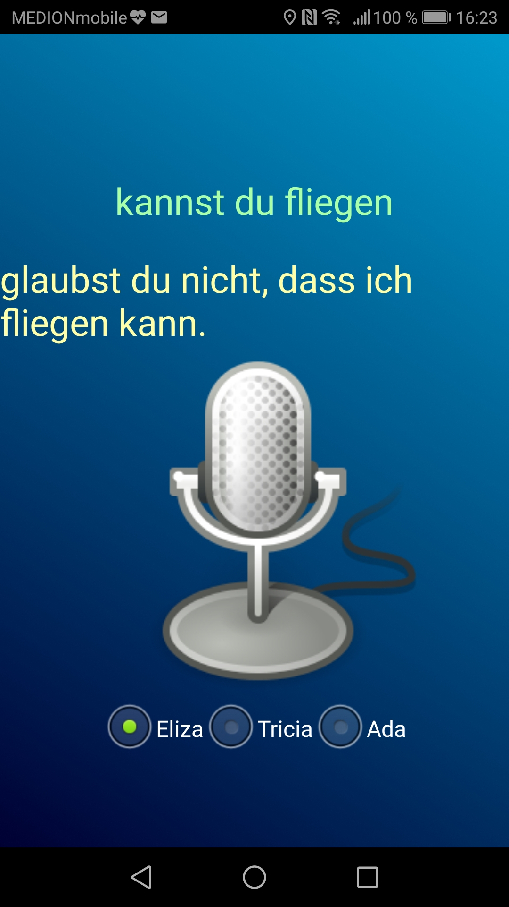
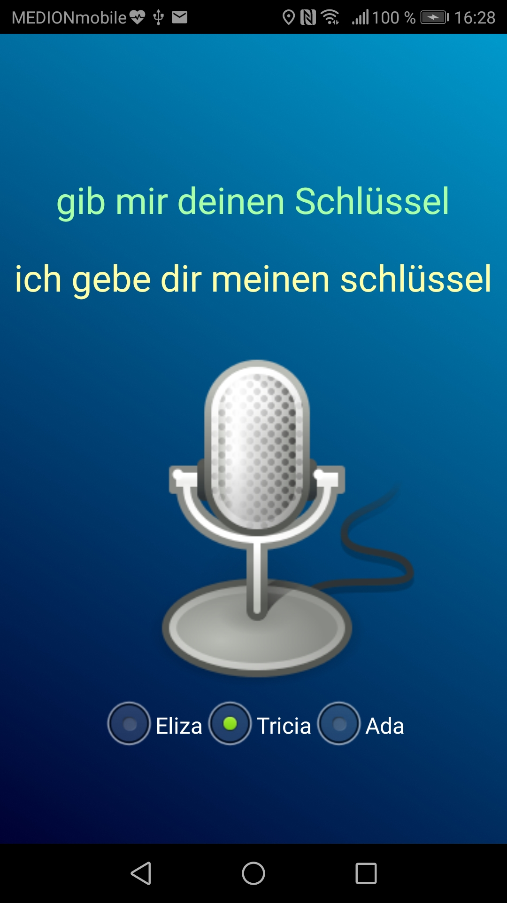

# Android Beispiel für Sprach-Ein-/Ausgabe

Die App nimmt einfache Spracheingaben an und reagiert mit Sprachausgaben. Es sind exemplarisch drei einfache ChatBots implementiert, die unterschiedliche Ausgaben produzieren.

* Eliza - Aussagen hinterfragen (verinfachte deutsche Version von [ELIZA](https://de.wikipedia.org/wiki/ELIZA))

* Tricia - Wandelt einfach nur ICH <-> DU etc. aus der Eingabe um

* Ada - ein einfacher Rechner für +, #, *, / mit zwei Operanden

